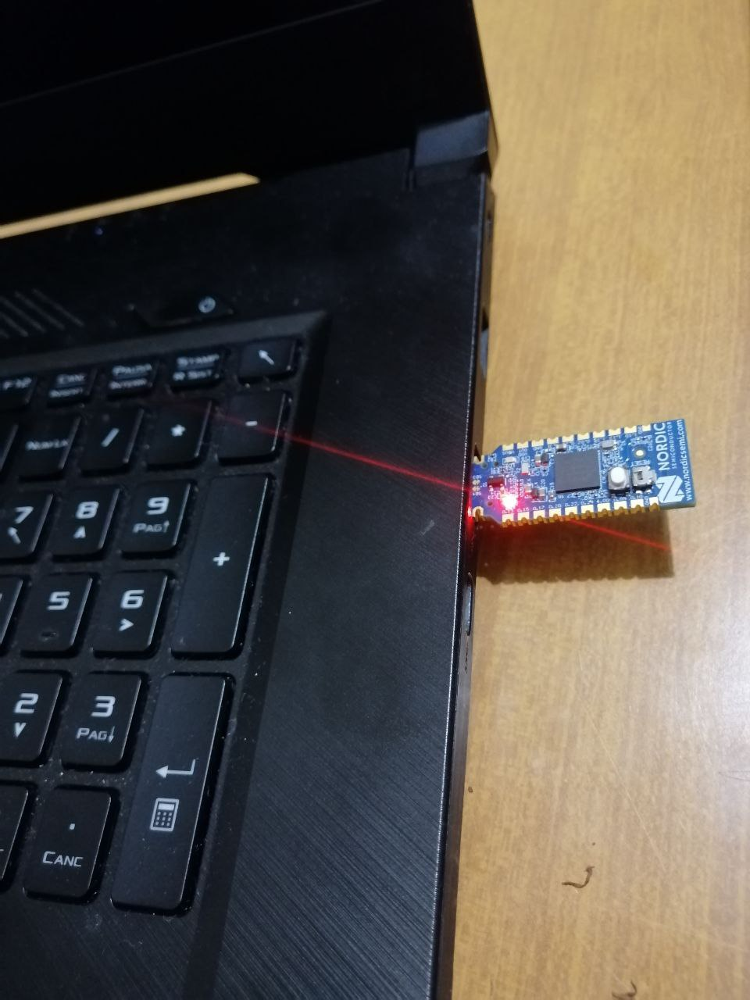
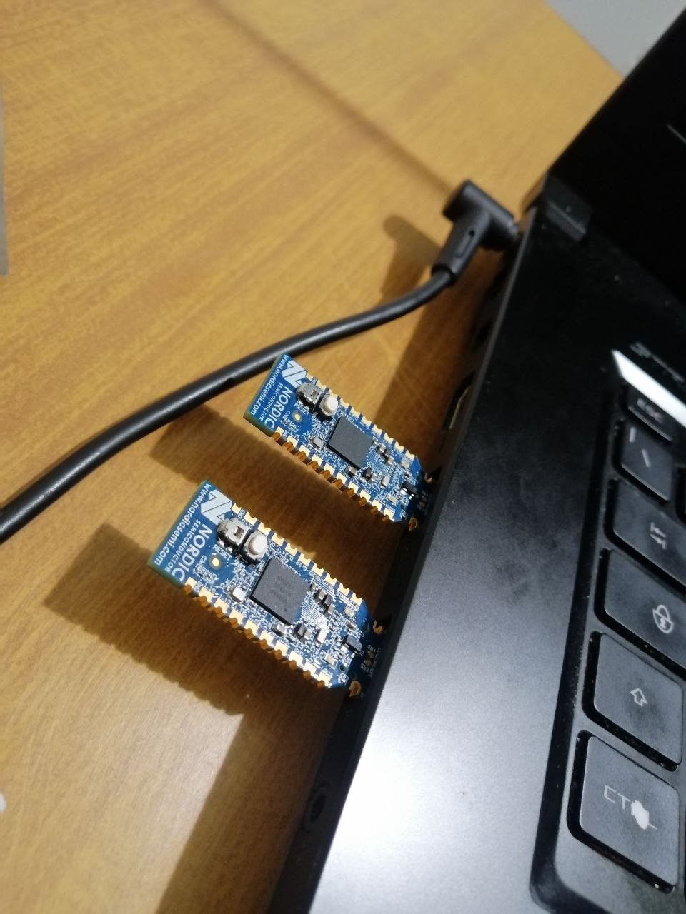
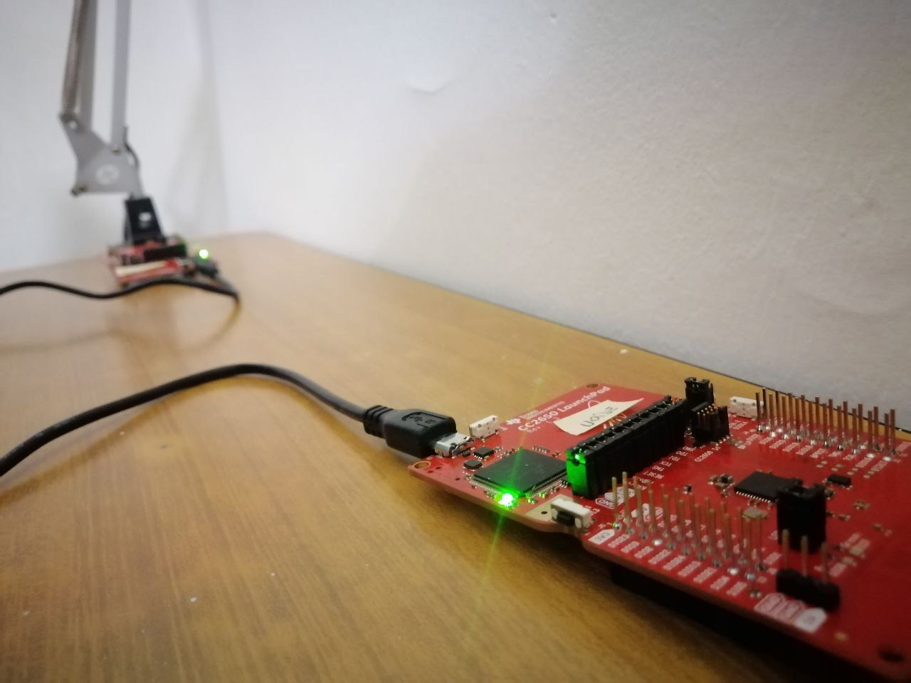
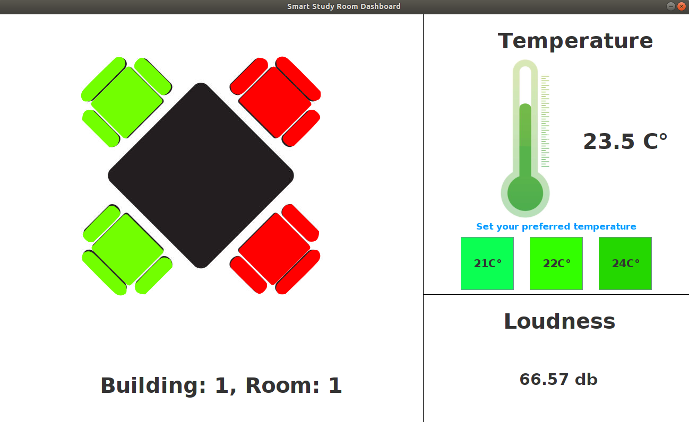

# SmartStudyRoom
SmartStudio is an IoT solution for monitoring study rooms. The devices (Dongle board nrf52840 and Launchpad CC2650) of each building, study room and room are able, thanks to protocols such as MQTT and CoAP, to obtain data from the environment (loudness, temperature and occupancy of seats) and to notify them to a client.

# Arrangement of sensors

  
   
  

# GUI

